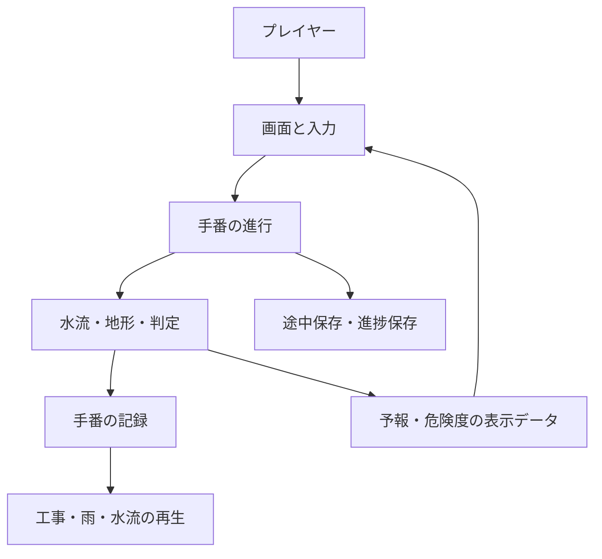
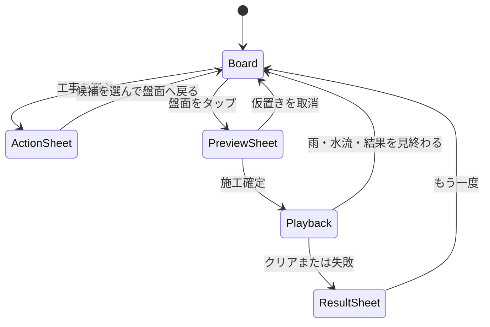
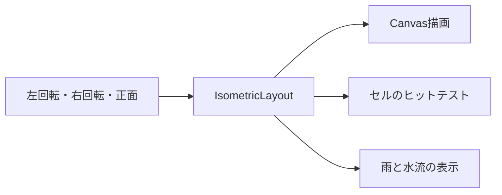

# ナガシマス 実装構成図

- **状態:** P0再設計対応中
- **更新日:** 2026-08-31（JST）
- **対象:** `chameleonjp-lab/nagashimasu`

## この文書の目的

前回までの実装は、水流計算、画面、入力、再生、保存が動作していた一方で、画面に情報を追加するたびに`main.ts`へ処理が集まり、プレイヤーが見る順番を設計しにくくなっていた。

この文書では、ゲームの責任範囲を「ルール」「手番の進行」「表示」「入力」「保存」に分ける。ゲーム内容を変えずに画面を作り直すときも、どの層を変更したかを追跡できるようにする。

## システム構成

### 層ごとの責任

| 層 | 主な場所 | してよいこと | してはいけないこと |
|---|---|---|---|
| ルール | `src/domain/` | 地形、水量、水流、勝敗、スコアを決める | 画面文字列やCanvas座標を持つ |
| 手番の進行 | `src/application/stage-controller.ts` | 入力を受け、Domainへ1回だけ渡し、受理結果を返す | 表示用に水流を再計算する |
| 保存 | `src/application/*-storage.ts`、`stage-save.ts` | 進捗と受理済み操作を保存・復元する | 未受理の入力を進行状態として保存する |
| 表示用変換 | `src/presentation/stage-projection.ts`、`stage-preview.ts` | 予報、危険度、説明文をDomainの結果から作る | 独自の勝敗判定を作る |
| 盤面表示 | `src/presentation/isometric.ts`、`board-renderer.ts` | 同じ座標変換で描画とヒットテストを行う | 画面上だけのセル番号を作る |
| 画面進行 | `src/main.ts` | 画面の表示段階、ボタン、再生の開始・終了をつなぐ | 水流の規則を直接実装する |
| 検査 | `tests/unit/`、`tests/dist/` | 各層の契約と配布物を検査する | CI成功だけで実機合格と扱う |

## プレイヤーが見る順番

スマートフォンでは、すべての情報を縦に並べない。1手を次の表示段階に分け、盤面を見失わないようにする。

### 常に見せる情報

- 目標は1つの短い文章で表示する。
- 次にすることは1つだけ表示する。
- 盤面には池、雨の場所、水の量、危険側、安全な出口を直接表示する。
- 詳しい凡例とセル番号表は、補助情報として折りたたむ。
- 施工確定、取消、見送りの意味をボタン内で説明する。

### スマートフォンの表示責任

| 状態 | 主画面 | 操作シート |
|---|---|---|
| 手番開始 | 盤面、池、予報、カメラ | 候補A/B、工事を選ぶ |
| 候補選択後 | 選んだ候補、置ける場所 | 盤面へ戻る |
| 仮置き中 | 施工前後、水流予測 | 予測、確定、取消 |
| 再生中 | 工事、雨、水流、結果の変化 | 操作不可 |
| 終端 | 最後の盤面、漏水位置 | 原因、次の改善、再挑戦 |

## 盤面カメラの構成

カメラは、描画と入力で別々に持たない。`IsometricLayout.rotation`を唯一の向きとして使う。

- 回転は90度単位の4方向とする。
- 回転しても論理セル番号、雨予報、施工可能セルは変わらない。
- 危険辺と安全辺は、論理方向を表示方向へ変換して描画する。
- 自由な3D回転や拡大縮小は、4方向表示の実機確認後に判断する。

## 実装組織の標準形

添付された実装組織図の表記を整理し、役割と判断境界を次のように固定する。

| 責任 | 担当 | 判断境界 |
|---|---|---|
| 作品の最終責任 | ユーザー本人 | 仕様採用、公開、マージを決める |
| 企画・設計・最終判断支援 | Sol・High | ゲーム体験、優先順位、仕様案を整理する |
| 日常の実装と進行 | Luna・Max | コード、テスト、文書を変更し、PRまで進める |
| 複雑な検査と不具合調査 | Luna・Max | 再現条件、原因、回帰テストを調べる |
| 反復確認と記録 | Luna・Max | 検査結果、未確認事項、実機手順を残す |
| 原因不明・安全性・重大判断 | Sol・Extra High | 進行を止めるべき問題と設計変更を判断する |
| 公開前の独立レビュー | Sol・High | 実装者と別の視点で公開可否を確認する |

### 作業の順番

1. 企画・設計が、プレイヤーの最初の1分に必要な体験を決める。
2. 実装担当が、Domainを壊さない範囲で画面と入力を変更する。
3. 検査担当が、通常操作・異常操作・狭い画面・配布物を検査する。
4. 独立レビューが、初見プレイヤーの理解とゲーム性を確認する。
5. ユーザーが、実機確認後にマージを判断する。

## 今回の対応範囲

### 対応した土台

- 盤面を4方向へ回転できる表示構造を追加した。
- 回転後も描画とセル入力が同じ論理セルを指すようにした。
- 池を空の状態でも盤面上に表示する構造を追加した。
- 水面を地形の後ろへ隠さない描画順へ変更した。
- 失敗時に危険側のセルを盤面上で強調できる構造を追加した。
- スマートフォンの操作を、画面下の操作シートへ分ける土台を追加した。
- 凡例とセル番号表を補助情報として折りたためる構造へ変更した。
- ポインター中断で仮置きを勝手に消さないようにした。

### 次の検査で確認すること

- 390px、402px、430px幅で、操作シートを開閉しても横はみ出しがないこと。
- 候補選択 → 盤面タップ → 予測確認 → 確定が、ページスクロールなしで行えること。
- 4方向の回転後も、セル選択、予報、危険辺、水流表示が一致すること。
- 空の池、雨、水面、流出位置が実機で見分けられること。
- ポインター中断後も仮置きが保持されること。
- 終端時に結果シートが最初に見え、再挑戦へ進めること。

## 合格条件

自動検査が成功しても、次の実機条件を満たすまでM5の追加ステージは開始しない。

- 初見プレイヤーが20秒以内に「雨の前に地形を変え、水をためる・安全に流すゲーム」と説明できる。
- 最初の施工を、盤面と操作を行き来するページスクロールなしで完了できる。
- 雨の場所、水が動いた場所、失敗の原因セルを盤面上で説明できる。
- カメラを左右へ回転し、隠れていたセルを確認できる。
- 1回の通常スクロールや画面遷移で、仮置きが消えない。
